# MOFC Sales Forecasting with Time Series Analysis 
### Goals
* Compare the accuracy of various time series forecasting algorithms such as *Prophet*, *DeepAR*, *VAR*, *DeepVAR*, and *LightGBM*
* (Optional) Use `tsfresh` for automated feature engineering of time series data.

### Requirements
* The dataset can be downloaded from [this Kaggle competition](https://www.kaggle.com/c/m5-forecasting-accuracy).
* In addition to the [Anaconda](https://www.anaconda.com) libraries, you need to install `altair`, `vega_datasets`, `category_encoders`, `mxnet`, `gluonts`, `kats` and `pandarallel`.
  * `kats` requires Python 3.7 or higher.

## Competition, Datasets and Evaluation
* [The M5 Competition](https://mofc.unic.ac.cy/m5-competition) aims to forecast daily sales for the next 28 days based on sales over the last 1,941 days for IDs of 30,490 items per Walmart store.
* Data includes (i) time series of daily sales quantity by ID, (ii) sales prices, and (iii) holiday and event information.
* Evaluation is done through *Weighted Root Mean Squared Scaled Error*. A detailed explanation is given in the M5 Participants Guide and the implementation is at [this link](https://www.kaggle.com/c/m5-forecasting-accuracy/discussion/133834).
* For hyperparameter tuning, 1% of IDs were randomly selected and used, and 10% were used to measure test set performance.

## Algorithms
### Kats: Prophet
* *Prophet* can incorporate forward-looking related time series into the model, so additional features were created with holiday and event information.
* Since a *Prophet* model has to fit for each ID, I had to use the `apply` function of the `pandas dataframe` and instead used `pandarallel` to maximize the parallelization performance.
* *Prophet* hyperparameters were tuned through 3-fold CV using the *Bayesian Optimization* module built into the `Kats` library. In this case, *[Tweedie](https://scikit-learn.org/stable/modules/generated/sklearn.metrics.mean_tweedie_deviance.html)* was applied as the loss function. 
Below is the hyperparameter tuning result.
  
|loss|seasonality_prior_scale|changepoint_prior_scale|changepoint_range|n_changepoints|holidays_prior_scale|yearly_seasonality|weekly_seasonality|daily_seasonality|seasonality_mode|
|:---:|:---:|:---:|:---:|:---:|:---:|:---:|:---:|:---:|:---:|
|517.939237|0.464159|0.004642|0.90|50|0.050|False|True|False|multiplicative|
|523.325939|0.215443|0.004642|0.89|50|0.100|False|True|False|multiplicative|
|537.711920|0.215443|0.010000|0.85|50|0.025|False|True|False|additive|
|...||||||||||
* In the figures below, the actual sales (black dots), the point predictions and confidence intervals (blue lines and bands), and the red dotted lines representing the test period are shown.
  
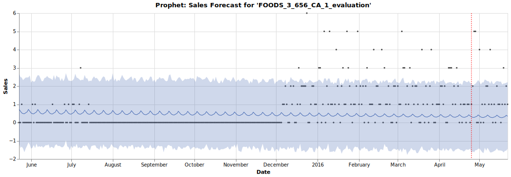
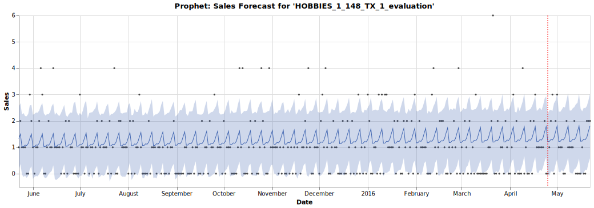

### Kats: VAR
* Since *VAR* is a multivariate time series model, the more IDs it fits simultaneously, the better the performance, and the memory requirement increases exponentially.
  
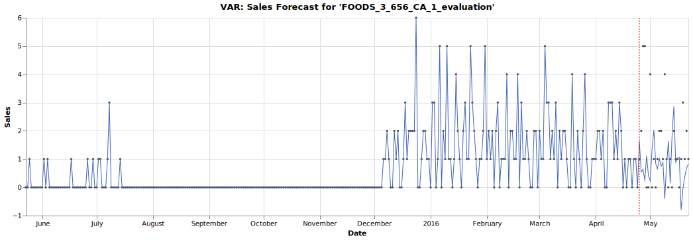
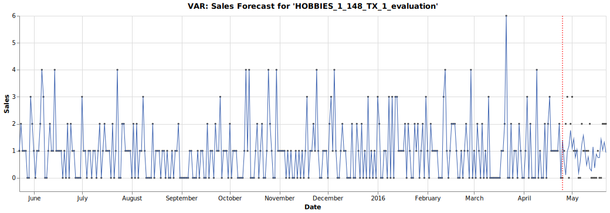
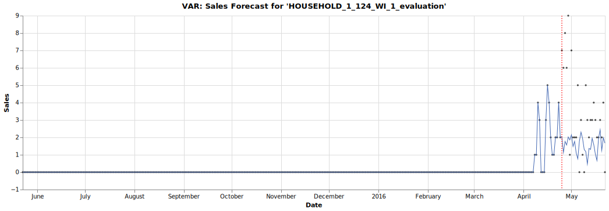

### GluonTS: DeepAR
* *DeepAR* can incorporate metadata and forward-looking related time series into the model, so additional features were created with sales prices, holiday and event information. Dynamic categorical variables were quantified through [Feature Hashing](https://alex.smola.org/papers/2009/Weinbergeretal09.pdf).
* As a hyperparameter, it is very important to set the probability distribution of the output, and here it is set as the *Negative Binomial* distribution.

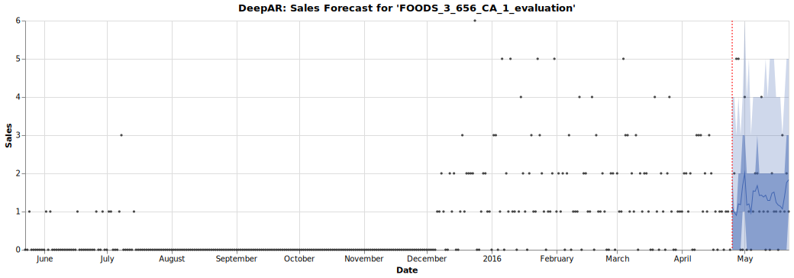
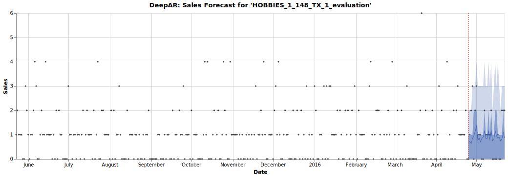
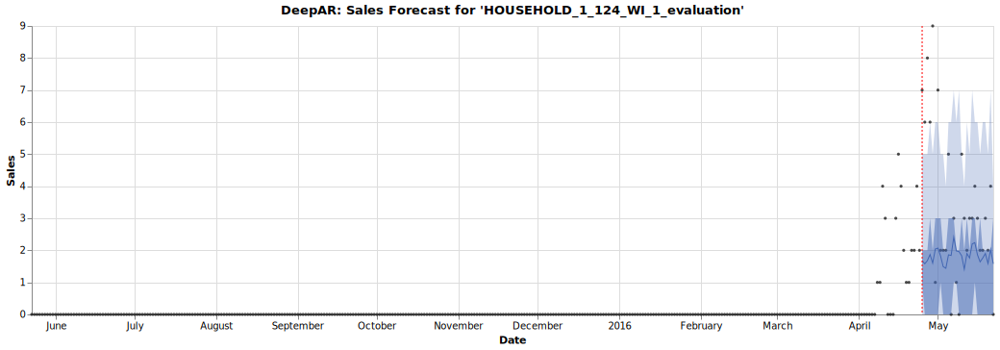

### GluonTS: DeepVAR
* In the case of *DeepVAR*, a multivariate model, what can be set as the probability distribution of the output is limited (i.e. *Multivariate Gaussian* distribution), which leads to a decrease in performance.
  
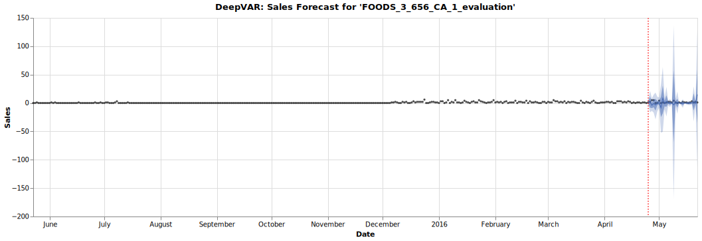
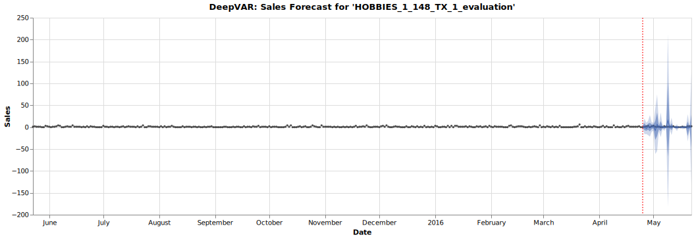
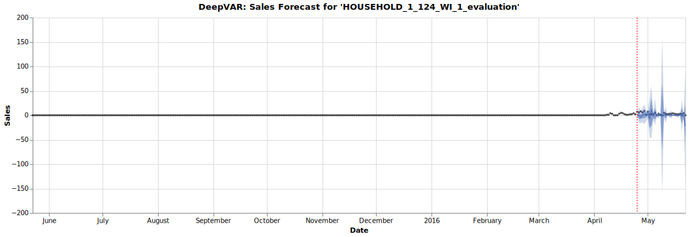

## Algorithms Performance Summary
|Algorithm|WRMSSE|MAPE|sMAPE|MAE|MASE|RMSE|
|:---:|:---:|:---:|:---:|:---:|:---:|:---:|
|DeepAR|0.7200|0.7749|1.5335|26.8035|1.3088|2.0850|
|VAR|0.7529||||||
|Prophet|0.8690|∞|1.4120|1.1167|1.6707|1.417|
|Naive Method|1.3940||||||
|Mean Method|1.5326||||||
|DeepVAR|2.1639|0.2100|0.2461|0.0134|2.2618|0.4092|

### References
* [Taylor SJ, Letham B. 2017. Forecasting at scale. *PeerJ Preprints* 5:e3190v2](https://peerj.com/preprints/3190.pdf)
* [Prophet: Forecasting at Scale](https://research.fb.com/blog/2017/02/prophet-forecasting-at-scale)
* [Stock, James, H., Mark W. Watson. 2001. Vector Autoregressions. *Journal of Economic Perspectives*, 15 (4): 101-115.](https://www.princeton.edu/~mwatson/papers/Stock_Watson_JEP_2001.pdf)
* [David Salinas, Valentin Flunkert, Jan Gasthaus, Tim Januschowski. 2020. DeepAR: Probabilistic forecasting with autoregressive recurrent networks, *International Journal of Forecasting*, 36 (3): 1181-1191.](https://arxiv.org/pdf/1704.04110.pdf)
* [How the DeepAR Algorithm Works](https://docs.aws.amazon.com/sagemaker/latest/dg/deepar_how-it-works.html)
* [David Salinas, Michael Bohlke-Schneider, Laurent Callot, Roberto Medico,
Jan Gasthaus. 2019. High-dimensional multivariate forecasting with low-rank Gaussian Copula Processes. *In Advances in Neural Information Processing Systems*. 6827–6837.](https://arxiv.org/pdf/1910.03002.pdf)
* [Kats - One Stop Shop for Time Series Analysis in Python](https://facebookresearch.github.io/Kats/)
* [GluonTS - Probabilistic Time Series Modeling](https://ts.gluon.ai/index.html)