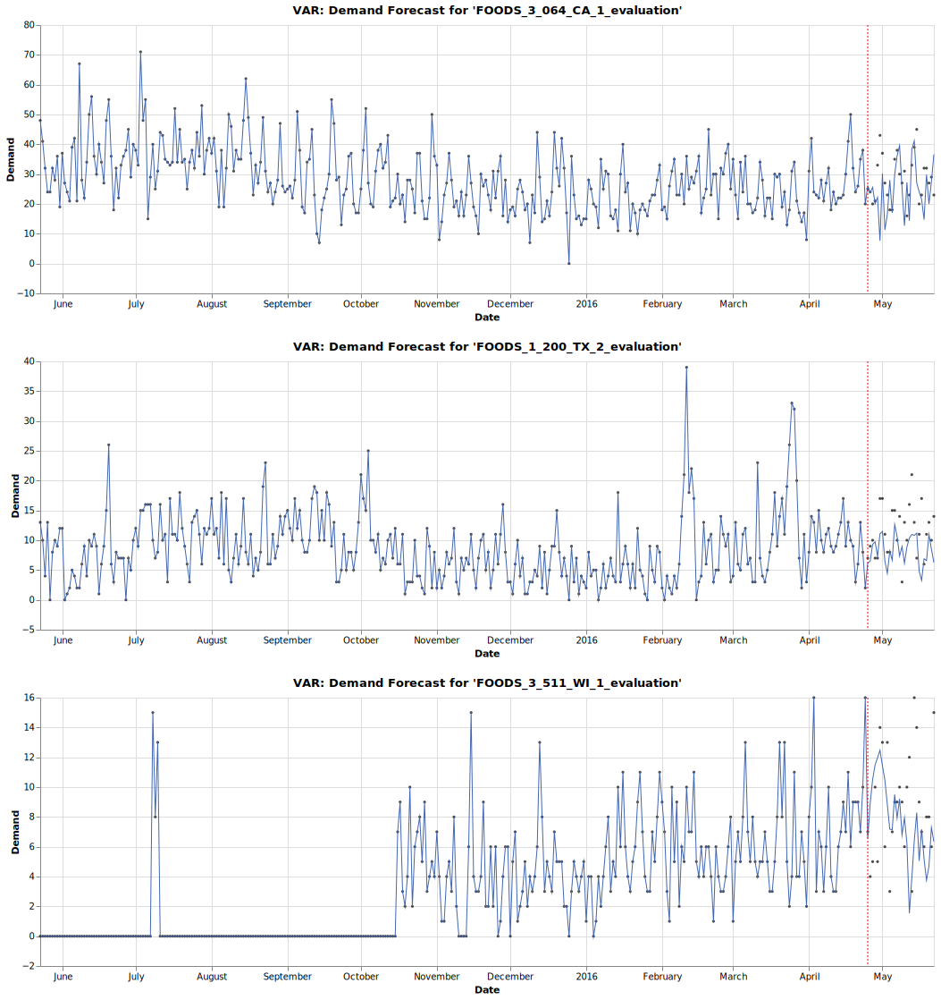
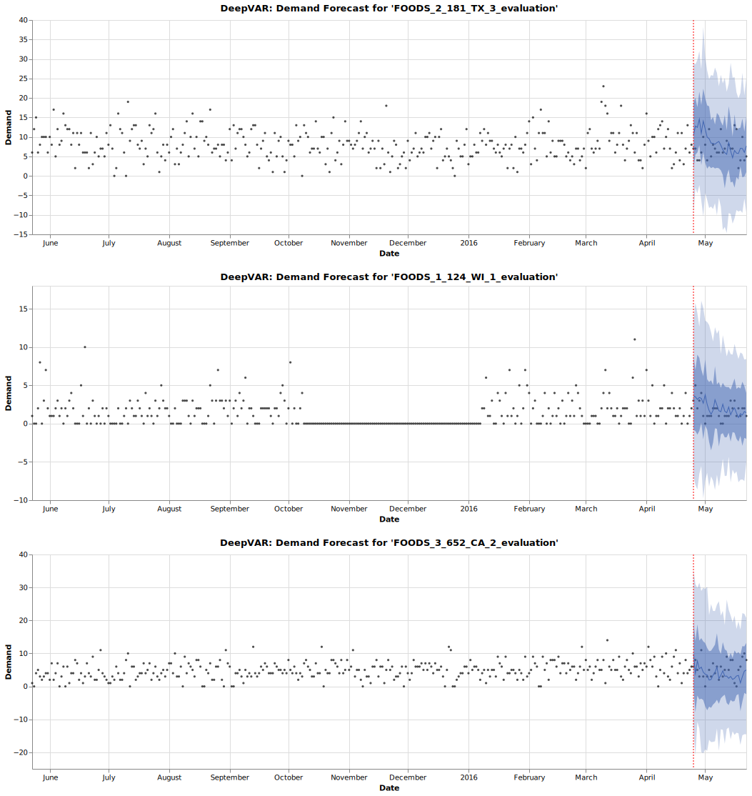
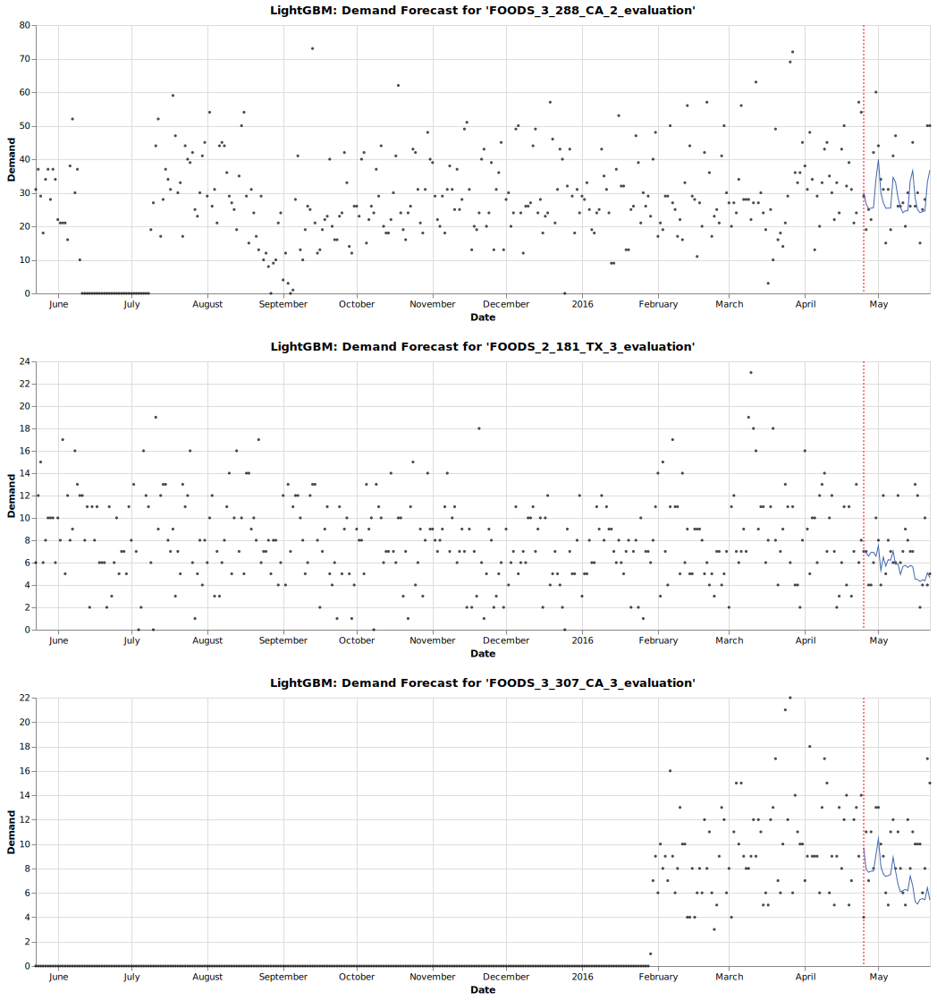

# MOFC Demand Forecasting with Time Series Analysis 
### Goals
* Compare the accuracy of various time series forecasting algorithms such as *Prophet*, *DeepAR*, *VAR*, *DeepVAR*, and *[LightGBM](https://papers.nips.cc/paper/2017/file/6449f44a102fde848669bdd9eb6b76fa-Paper.pdf)*
* (Optional) Use `tsfresh` for automated feature engineering of time series data.

### Requirements
* The dataset can be downloaded from [this Kaggle competition](https://www.kaggle.com/c/m5-forecasting-accuracy).
* In addition to the [Anaconda](https://www.anaconda.com) libraries, you need to install `altair`, `vega_datasets`, `category_encoders`, `mxnet`, `gluonts`, `kats`, `lightgbm`, `hyperopt` and `pandarallel`.
  * `kats` requires Python 3.7 or higher.

## Competition, Datasets and Evaluation
* [The M5 Competition](https://mofc.unic.ac.cy/m5-competition) aims to forecast daily sales for the next 28 days based on sales over the last 1,941 days for IDs of 30,490 items per Walmart store.
* Data includes (i) time series of daily sales quantity by ID, (ii) sales prices, and (iii) holiday and event information.
* Evaluation is done through *Weighted Root Mean Squared Scaled Error*. A detailed explanation is given in the M5 Participants Guide and the implementation is at [this link](https://www.kaggle.com/c/m5-forecasting-accuracy/discussion/133834).
* For hyperparameter tuning, 0.1% of IDs were randomly selected and used, and 1% were used to measure test set performance.

## Algorithms
### Kats: Prophet
* *Prophet* can incorporate forward-looking related time series into the model, so additional features were created with holiday and event information.
* Since a *Prophet* model has to fit for each ID, I had to use the `apply` function of the `pandas dataframe` and instead used `pandarallel` to maximize the parallelization performance.
* *Prophet* hyperparameters were tuned through 3-fold CV using the *Bayesian Optimization* module built into the `Kats` library. In this case, *[Tweedie](https://scikit-learn.org/stable/modules/generated/sklearn.metrics.mean_tweedie_deviance.html)* was applied as the loss function. Below is the hyperparameter tuning result.
  
|seasonality_prior_scale|changepoint_prior_scale|changepoint_range|n_changepoints|holidays_prior_scale|seasonality_mode|
|:---:|:---:|:---:|:---:|:---:|:---:|
|0.01|0.046|0.93|5|100.00|multiplicative|

* In the figures below, the actual sales (black dots), the point predictions and confidence intervals (blue lines and bands), and the red dotted lines representing the test period are shown.
  

### Kats: VAR
* Since *VAR* is a multivariate time series model, the more IDs it fits simultaneously, the better the performance, and the memory requirement increases exponentially.
  

### GluonTS: DeepAR
* *DeepAR* can incorporate metadata and forward-looking related time series into the model, so additional features were created with sales prices, holiday and event information. Dynamic categorical variables were quantified through [Feature Hashing](https://alex.smola.org/papers/2009/Weinbergeretal09.pdf).
* As a hyperparameter, it is very important to set the probability distribution of the output, and here it is set as the *Negative Binomial* distribution.

### GluonTS: DeepVAR
* In the case of *DeepVAR*, a multivariate model, what can be set as the probability distribution of the output is limited (i.e. *Multivariate Gaussian* distribution), which leads to a decrease in performance.
  

### LightGBM
* I used `tsfresh` to convert time series into structured data features, which consumes a lot of computational resources even with minimal settings.
* A *LightGBM* *Tweedie* regression model  was fitted. Hyperparameters were tuned via 3-fold CV using the *Bayesian Optimization* function of the `hyperopt` library. The following is the hyperparameter tuning result.
  
|boosting|learning_rate|num_iterations|num_leaves|min_data_in_leaf|min_sum_hessian_in_leaf|bagging_fraction|bagging_freq|feature_fraction|extra_trees|lambda_l1|lambda_l2|path_smooth|max_bin|
|:---:|:---:|:---:|:---:|:---:|:---:|:---:|:---:|:---:|:---:|:---:|:---:|:---:|:---:|
|gbdt|0.01773|522|11|33|0.0008|0.5297|4|0.5407|False|2.9114|0.2127|217.3879|1023|
  
* The sales forecast for day D+1 was used recursively to predict the sales volume for day D+2 through feature engineering, and through this iterative process, 28-day test set performance was measured.

## Algorithms Performance Summary
|Algorithm|WRMSSE|sMAPE|MAE|MASE|RMSE|
|:---:|:---:|:---:|:---:|:---:|:---:|
|DeepAR|0.7513|1.4200|0.8795|0.9269|1.1614|
|LightGBM|1.0701|1.4429|0.8922|0.9394|1.1978|
|Prophet|1.0820|1.4174|1.1014|1.0269|1.4410|
|VAR|1.2876|2.3818|1.5545|1.6871|1.9502|
|Naive Method|1.3430|1.5074|1.3730|1.1077|1.7440|
|Mean Method|1.5984|1.4616|1.1997|1.0708|1.5352|
|DeepVAR|4.6933|4.6847|1.9201|1.3683|2.3195|

As a result, *DeepAR* was finally selected and submitted its predictions to Kaggle, achieving a WRMSSE value of 0.8112 based on the private leaderboard.

### References
* [Taylor SJ, Letham B. 2017. Forecasting at scale. *PeerJ Preprints* 5:e3190v2](https://peerj.com/preprints/3190.pdf)
* [Prophet: Forecasting at Scale](https://research.fb.com/blog/2017/02/prophet-forecasting-at-scale)
* [Stock, James, H., Mark W. Watson. 2001. Vector Autoregressions. *Journal of Economic Perspectives*, 15 (4): 101-115.](https://www.princeton.edu/~mwatson/papers/Stock_Watson_JEP_2001.pdf)
* [David Salinas, Valentin Flunkert, Jan Gasthaus, Tim Januschowski. 2020. DeepAR: Probabilistic forecasting with autoregressive recurrent networks, *International Journal of Forecasting*, 36 (3): 1181-1191.](https://arxiv.org/pdf/1704.04110.pdf)
* [David Salinas, Michael Bohlke-Schneider, Laurent Callot, Roberto Medico,
Jan Gasthaus. 2019. High-dimensional multivariate forecasting with low-rank Gaussian Copula Processes. *In Advances in Neural Information Processing Systems*. 6827–6837.](https://arxiv.org/pdf/1910.03002.pdf)
* [Kats - One Stop Shop for Time Series Analysis in Python](https://facebookresearch.github.io/Kats/)
* [GluonTS - Probabilistic Time Series Modeling](https://ts.gluon.ai/index.html)